## Alan Doyle Costa Ribeiro

Estudo analise e desenvolvimento de sistemas e passo o tempo livre construindo coisas pequenas que resolvem problemas reais: simulador de estrutura de dados pra estudar pra prova, app pra não perder prazo de trabalho, otimizador de imagem que roda direto no browser.

A maior parte do que está aqui nasceu de aula ou de curiosidade. Alguns viraram projeto de verdade.

### Stack

### Projetos

| Repositório | O que é | Stack |
| --- | --- | --- |
| **[ProjetosNITTRANS](https://github.com/zAlanRibeiro/ProjetosNITTRANS)** | Hub de ferramentas desktop pra automatizar processo administrativo da NITTRANS: tarjar PDF, cruzar multas de DETRAN e RENAINF, geocodificar endereço, gerar estatística do SEI | Python |
| **[JogoTransito](https://zalanribeiro.github.io/JogoTransito/)** | Jogo educativo de travessia segura, também pra NITTRANS: atravessar Niterói respeitando o semáforo até chegar na praia. Tem teste unitário e e2e rodando no CI | React |
| **[Studo](https://github.com/zAlanRibeiro/Studo)** | Organizador de vida acadêmica: matérias, prazos e notas num lugar só | TypeScript |
| **[DataStructs](https://zalanribeiro.github.io/DataStructs/)** | Simulador visual de estruturas de dados. Dá pra empilhar, enfileirar e ver o que acontece | JavaScript |
| **[CentralMonitoramento](https://central-monitoramento.vercel.app)** | Painel de monitoramento em tempo real | JavaScript |
| **[DocPocket](https://github.com/zAlanRibeiro/DocPocket)** | Carteira digital pra guardar documento em foto | CSS |
| **[OtimizadorDeImagensAI](https://github.com/zAlanRibeiro/OtimizadorDeImagensAI)** | Comprime imagem no navegador, sem passar por servidor | JavaScript |
| **[Stellar-Legacy](https://github.com/Snoopynha/Stellar-Legacy)** | Jogo educativo de habitats espaciais, feito no NASA Space Apps 2025 | Python |

### GitHub

### Contato

